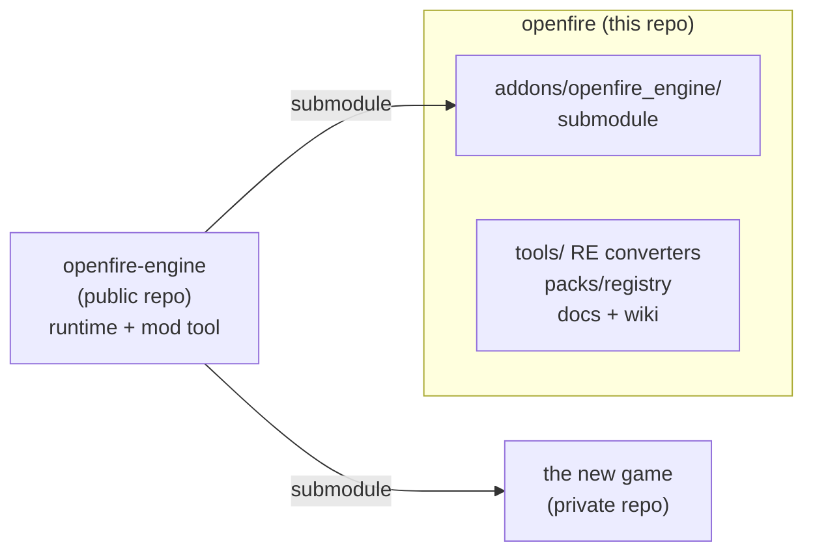

# Return Fire — Godot port

A from-scratch, data-driven Godot 4 reimplementation of *Return Fire* (1996, Silent
Software), the PC/Win95 port of the 3DO original — built on an **agnostic engine**,
[openfire-engine](https://github.com/alexdia25/openfire-engine), mounted here as a git
submodule at `addons/openfire_engine/`. The engine only ever reads pack data (JSON + loose
sprite frames) and names no game, so the same engine also supports building a wholly
original game on top of it. This repo is everything Return-Fire-specific: the reverse
engineering, the converters that turn the original files into a pack, and the docs.



Clone with the engine included:

```bash
git clone --recurse-submodules https://github.com/alexdia25/openfire.git
```

(or, in an existing clone, `git submodule update --init`).

Full plan, ground-truth format notes, architecture decisions and phase-by-phase
execution steps: [docs/PORTING_PLAN.md](docs/PORTING_PLAN.md). Read that file before
doing anything else in this repo — it is written to be self-contained.

New to reverse engineering, or want to follow (and eventually continue) the process
rather than just the results? Start at [the project wiki](https://github.com/alexdia25/openfire/wiki/) —
a narrative, example-driven walkthrough of how each format got cracked so far, and how to
keep going. Open work is tracked as [GitHub issues](https://github.com/alexdia25/openfire/issues).

## Two ways this engine ships

- **A fresh, original game.** Its own content pack ships pre-bundled inside the compiled
  release (`res://packs/<id>`), built once at release time. No Return Fire files involved
  anywhere, no import step — this build has to just always work.
- **"Open Fire" mode.** The same engine, shipped without any Return Fire content. On first
  launch it asks for the location of the player's own legally-obtained copy of the
  original game, converts it locally into a pack, and becomes a full authentic port from
  then on. This is the model used by devilutionX, OpenRCT2, and OpenTTD — see the Legal
  section below. Planned in [issue #61](https://github.com/alexdia25/openfire/issues/61);
  not built yet.

Both are the same codebase and the same `Pack`-shaped content format — mods layer on top
identically in either one (the engine's `ModLoader`), loaded from anywhere on the player's
drive. What differs is only how the base pack gets there: baked in at build time, or
generated locally on first run.

## Why Godot

- A real 3D renderer, node/scene graph, and one export pipeline across platforms, without
  writing any of that from scratch.
- Headless scripting (`godot --headless --script ...`) doubles as this project's entire
  test harness — every check under `tools/tests/` runs real engine code (real pack
  loading, real rendering, real physics), not a mocked-up substitute.
- The editor's Inspector, debugger, and remote scene tree work on this project's own nodes
  for free — exported vars, breakpoints, and a live scene tree of a running level all come
  from adopting Godot rather than being built here.
- `UndoRedo` backs the mod tool's edit history (the engine's `editor/workspace.gd`) — no hand-rolled
  undo stack.
- `FileAccess`/`DirAccess` abstract `res://`/`user://`/absolute paths per OS, which is most
  of why packs, mods, and (planned) imported content can live anywhere on disk without any
  platform-specific path handling being written.
- Swappable audio drivers, including `Dummy`, are why headless test runs can exercise
  the engine's `SoundManager` with no real audio device at all.

One deliberate opt-out: pack art loads through raw `Image.load()` (the engine's `Pack`), not
Godot's `res://` import pipeline — so packs, mods, and imported content stay swappable at
runtime instead of being baked into a `.import` cache.

Because the engine only ever consumes pack data, once a real pack exists locally, opening
this project directly in the Godot editor and running any scene renders authentic traced
content — not placeholders — with the full editor toolset (viewport, Inspector, debugger)
available against it.

## Legal

This repository contains **no game assets and no decompiled game code**. It ships
converters and engine code only. To build or run anything asset-dependent, point the
dev pipeline (or, once built, "Open Fire" mode's first-run setup) at your own
legally-obtained copy of *Return Fire*. This is the same model used by devilutionX,
OpenRCT2, and OpenTTD.

## Layout

```
/addons/openfire_engine/  the engine (git submodule: runtime game/, mod tool editor/, its own tests/)
/tools/                   Python asset converters + pack validator (the dev pipeline)
/tools/tests/             headless checks against the real traced pack
/packs/                   content packs + the asset ID registry (generated, mostly gitignored)
/docs/                    the plan and format notes
/build/                   converter output -- gitignored, regenerate locally from your own install
```

Which pack the engine runs is set in `project.godot` (`[openfire] packs/base_pack`), not in
engine code; see the engine's README for every setting a game can make.

## Running it

- **Build the pack** from your own install, in one step:
  `python tools/import_original.py <your Return Fire folder> packs/original_pc`
  (needs Python 3 + Pillow; ffmpeg and the CD image `RFIRE US.iso` for the music, which is
  skipped with a warning without them).
- **The game:** open this project in the Godot 4 editor and run it, or
  `godot --path . --audio-driver Dummy` (mute audio driver recommended on this project's
  dev machine) from the command line.
- **The mod tool:** `godot --path . res://addons/openfire_engine/editor/editor_main.tscn`.
- **Tests:** each check under `tools/tests/` is its own headless run, e.g.
  `godot --headless --audio-driver Dummy --path . --script tools/tests/<name>.gd`.
  The engine's own checks (no Return Fire content needed) run from its checkout:
  `addons/openfire_engine/tools/run_tests.sh`.
