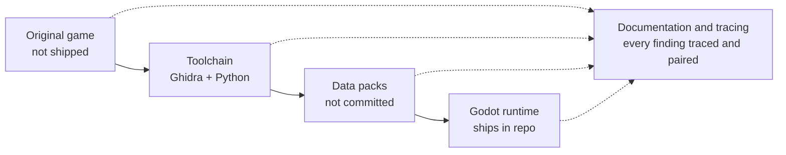
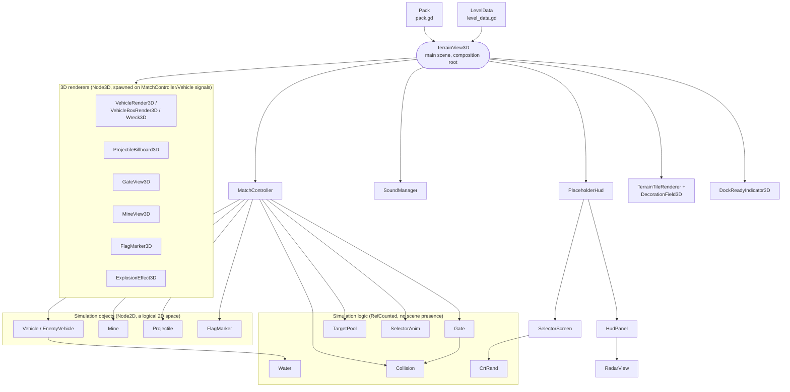
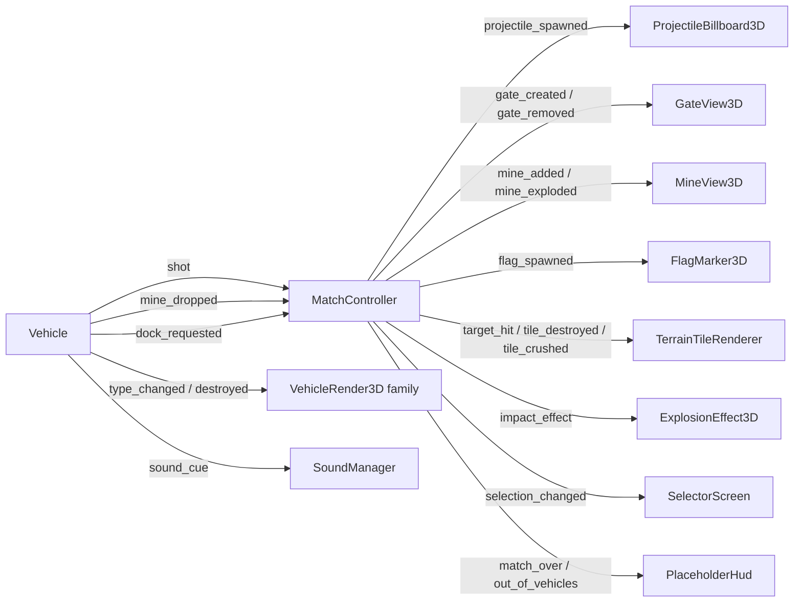

# Architecture

Two diagrams: the offline pipeline that turns the original game into a Godot pack, and the
shape of the runtime code that pack loads into. For the detailed ground truth behind either
one, see [`PORTING_PLAN.md`](PORTING_PLAN.md); for how each piece was found, see
[`docs/process/`](process/README.md).

## The pipeline

The original 1996 executable and its data files (`C:\Users\Alex\Documents\returnfire`) are
never touched by the shipped code — Ghidra and a set of Python extractors
(`tools/extract_*.py`, `tools/convert_*.py`) read them offline and produce a **data pack**
(`packs/original_pc/`: sprites, terrain, levels, vehicles, HUD, audio). Packs embed real
extracted pixel and audio data, so — like the Ghidra project and every raw `.RFA`/`.RFM`/
`.SDT`/`.CAR`/`.BIN` file — they're gitignored; only the hand-authored ID registry under
`packs/registry/` is tracked. The Godot runtime (`game/*.gd`) is the only stage that ships:
it loads a pack at runtime (never through `res://` import, since the pack doesn't exist at
edit time) and contains no decompiled code or original assets, just GDScript. Underneath all
four stages, `docs/process/NN-*.md` pairs each decompiled/disassembled finding with the port
code it became, and `PORTING_PLAN.md` is the standing summary of all of it.

## Runtime internals

`game/terrain_view_3d.gd` (no `class_name`; it's the main scene's own script,
`res://game/terrain_view_3d.tscn`) is the actual composition root — it builds `Pack` and
`LevelData`, then creates `MatchController` and `SoundManager` as children, and reactively
adds a 3D renderer node any time `MatchController`/`Vehicle` announces something new (a
vehicle, a shot, a gate). Everything below is real `.new()`/`add_child()` calls in that file
and in `MatchController`, not a simplification:

The split down the middle is real, not incidental: `Vehicle`, `Mine`, `Projectile` and
`FlagMarker` all `extend Node2D` — the simulation runs entirely in a logical 2D space (the
same coordinate system the original game's fixed-point code used), with no 3D representation
of its own. Every `*_3d.gd` node under **3D renderers** only *reads* one of those Node2D
objects each frame and draws it in the actual 3D scene — it owns no gameplay state. `Gate`,
`TargetPool`, `SelectorAnim`, `Water`, `Collision` and `CrtRand` are plainer still: they
`extend RefCounted`, so they never enter the scene tree at all, just plain data/logic objects
`MatchController` (or another RefCounted object) holds a reference to.

### Signal flow

`MatchController` and `Vehicle` never reach into a renderer directly; they emit signals and
`terrain_view_3d.gd` (or `SoundManager`, or the HUD) is what's listening:

One exception: `DockReadyIndicator3D` polls `MatchController.can_dock(vehicle)` every frame
(document 80) rather than waiting on a signal, since "am I currently eligible to dock" is a
continuous condition, not a discrete event.

`tools/tests/*.gd` are headless Godot scripts that exercise `MatchController`/`Vehicle`
directly (no scene, no renderer) to check traced numbers — tick counts, damage, stock — against
the disassembly.

---
*Diagrams are hand-authored, not from the original game, and reflect the state as of document
84 (2026-09-22) — cross-checked against real `class_name`/`extends` declarations and
`.new()`/`add_child()` call sites in `game/`, not just prose. Regenerate them (ask an agent to
update this file) if the module boundaries above drift.*
