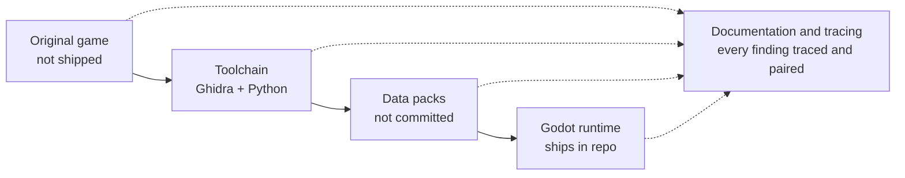
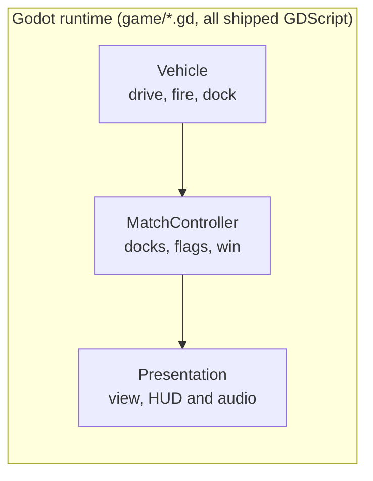

# Architecture

Two diagrams: the offline pipeline that turns the original game into a Godot pack, and the
shape of the runtime code that pack loads into. For the detailed ground truth behind either
one, see [`PORTING_PLAN.md`](PORTING_PLAN.md); for how each piece was found, see
[`docs/process/`](process/README.md).

## The pipeline

The original 1996 executable and its data files (`C:\Users\Alex\Documents\returnfire`) are
never touched by the shipped code — Ghidra and a set of Python extractors
(`tools/extract_*.py`, `tools/convert_*.py`) read them offline and produce a **data pack**
(`packs/original_pc/`: sprites, terrain, levels, vehicles, HUD, audio). Packs embed real
extracted pixel and audio data, so — like the Ghidra project and every raw `.RFA`/`.RFM`/
`.SDT`/`.CAR`/`.BIN` file — they're gitignored; only the hand-authored ID registry under
`packs/registry/` is tracked. The Godot runtime (`game/*.gd`) is the only stage that ships:
it loads a pack at runtime (never through `res://` import, since the pack doesn't exist at
edit time) and contains no decompiled code or original assets, just GDScript. Underneath all
four stages, `docs/process/NN-*.md` pairs each decompiled/disassembled finding with the port
code it became, and `PORTING_PLAN.md` is the standing summary of all of it.

## Runtime internals

`Vehicle` (`game/vehicle.gd`) is the per-vehicle simulation: movement, weapons, ammunition,
mines, the docking trigger, and a generic `sound_cue` signal. `MatchController`
(`game/match_controller.gd`) is the orchestrator: docking/undocking, the mine reserve, flags,
the win condition, vehicle selection at the base. Everything under **Presentation** only
*reads* that state to show or play it — the 3D renderers (`vehicle_render_3d.gd`,
`terrain_view_3d.gd` and its siblings), the 2D HUD/radar/hangar-selector screen, and
`sound_manager.gd`. The arrows simplify a two-way relationship: Presentation and
`SoundManager` actually listen to signals `Vehicle` and `MatchController` emit, rather than
being polled by them.

`tools/tests/*.gd` are headless Godot scripts that exercise `MatchController`/`Vehicle`
directly (no scene, no renderer) to check traced numbers — tick counts, damage, stock — against
the disassembly.

---
*Diagrams are hand-authored, not from the original game, and reflect the state as of document
83 (2026-09-22). Regenerate them (ask an agent to update this file) if the module boundaries
above drift.*
