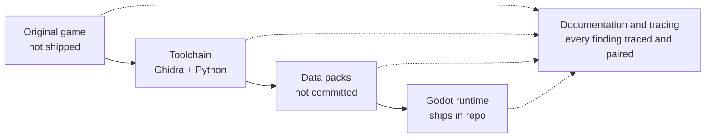
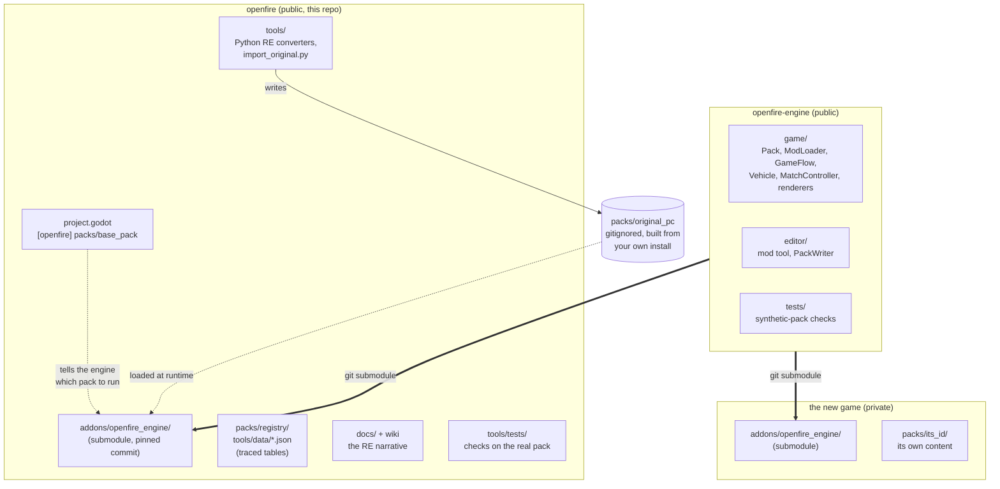

# Architecture

The offline pipeline that turns the original game into a Godot pack, and the shape of the
runtime code that pack loads into — the latter as a few diagrams that go from a glance to the
actual call sites, each one level deeper than the last, rather than one diagram trying to
show everything at once. For the detailed ground truth behind either half, see
[`PORTING_PLAN.md`](PORTING_PLAN.md); for how each piece was found, see
[the wiki](https://github.com/alexdia25/openfire/wiki/) (the worked examples) and [the issues](https://github.com/alexdia25/openfire/issues) (open work).

## The pipeline

```mermaid
flowchart LR
    A["Original game<br/>not shipped"]
    B["Toolchain<br/>Ghidra + Python"]
    C["Data packs<br/>not committed"]
    D["Godot runtime<br/>ships in repo"]
    A --> B --> C --> D
    Docs["Documentation and tracing<br/>every finding traced and paired"]
    A -.-> Docs
    B -.-> Docs
    C -.-> Docs
    D -.-> Docs
```

The original 1996 executable and its data files (`C:\Users\Alex\Documents\returnfire`) are
never touched by the shipped code — Ghidra and a set of Python extractors
(`tools/extract_*.py`, `tools/convert_*.py`) read them offline and produce a **data pack**
(`packs/original_pc/`: sprites, terrain, levels, vehicles, HUD, audio). Packs embed real
extracted pixel and audio data, so — like the Ghidra project and every raw `.RFA`/`.RFM`/
`.SDT`/`.CAR`/`.BIN` file — they're gitignored; only the hand-authored ID registry under
`packs/registry/` is tracked. The Godot runtime (the engine, `addons/openfire_engine/`) is the only stage that ships:
it loads a pack at runtime (never through `res://` import, since the pack doesn't exist at
edit time) and contains no decompiled code or original assets, just GDScript. Underneath all
four stages, the [wiki's worked examples](https://github.com/alexdia25/openfire/wiki/) pair each decompiled/disassembled finding with the port
code it became, and `PORTING_PLAN.md` is the standing summary of all of it.

A pack need not stand alone: `Pack` loads a **stack** of them (`PORTING_PLAN.md` section 2.7.4) — a
mod's `pack.json` names its `base_pack`, which loads underneath it, and the mod overrides the base per
id (one sprite, one vehicle type, one sound cue, one level) rather than replacing it wholesale. The
`Pack` node in the diagrams below stands for that whole resolved stack.

The mod tool (the engine's `editor/`, run `godot --path . res://addons/openfire_engine/editor/editor_main.tscn`;
[`EDITOR_PLAN.md`](EDITOR_PLAN.md)) is a second, separate scene over the same `Pack`: it opens one mod layer as a
`ModWorkspace`, edits it live and writes only that layer back.

## Two repositories

Since issue #62 the runtime lives in its own repository,
[openfire-engine](https://github.com/alexdia25/openfire-engine), and this repo consumes it as a git
submodule at `addons/openfire_engine/`, exactly as any other game built on it does. The split follows one
rule: **the engine names no game.** Anything that only makes sense for Return Fire stays here.

```mermaid
flowchart TB
    subgraph engine["openfire-engine (public)"]
        direction LR
        EG["game/<br/>Pack, ModLoader, GameFlow,<br/>Vehicle, MatchController, renderers"]
        EE["editor/<br/>mod tool, PackWriter"]
        ET["tests/<br/>synthetic-pack checks"]
    end
    subgraph openfire["openfire (public, this repo)"]
        direction LR
        SUB["addons/openfire_engine/<br/>(submodule, pinned commit)"]
        TOOLS["tools/<br/>Python RE converters,<br/>import_original.py"]
        REG["packs/registry/<br/>tools/data/*.json<br/>(traced tables)"]
        DOCS["docs/ + wiki<br/>the RE narrative"]
        TESTS["tools/tests/<br/>checks on the real pack"]
        CFG["project.godot<br/>[openfire] packs/base_pack"]
    end
    subgraph newgame["the new game (private)"]
        direction LR
        NSUB["addons/openfire_engine/<br/>(submodule)"]
        NP["packs/its_id/<br/>its own content"]
    end
    engine == "git submodule" ==> SUB
    engine == "git submodule" ==> NSUB
    CFG -. "tells the engine<br/>which pack to run" .-> SUB
    TOOLS -- "writes" --> PACK[("packs/original_pc<br/>gitignored, built from<br/>your own install")]
    PACK -. "loaded at runtime" .-> SUB
```

| Lives in | What | Why there |
|---|---|---|
| openfire-engine | `game/` (runtime), `editor/` (mod tool), engine tests | reusable by any game; never names one |
| openfire | `tools/` (converters, `import_original.py`), `tools/data/`, `packs/registry/` | Return Fire's file formats and traced tables |
| openfire | `tools/tests/` | checks that need the real traced pack: authenticity (movement, sounds, the level 1 playthrough) and engine behaviour exercised on real content |
| openfire | `docs/`, the wiki | the reverse-engineering record |

A change the engine needs is a normal PR to openfire-engine, then a submodule bump here (`git submodule update
--remote addons/openfire_engine`, then commit the new pointer). Never edit files inside the submodule checkout as
part of an openfire change. The engine's own docs cover its internals: the runtime's composition, signal
flow and how packs/mods resolve are in
[openfire-engine's ARCHITECTURE.md](https://github.com/alexdia25/openfire-engine/blob/main/docs/ARCHITECTURE.md).
