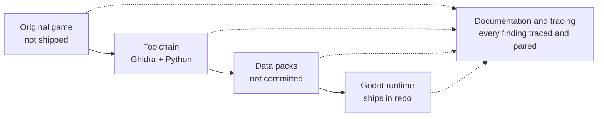
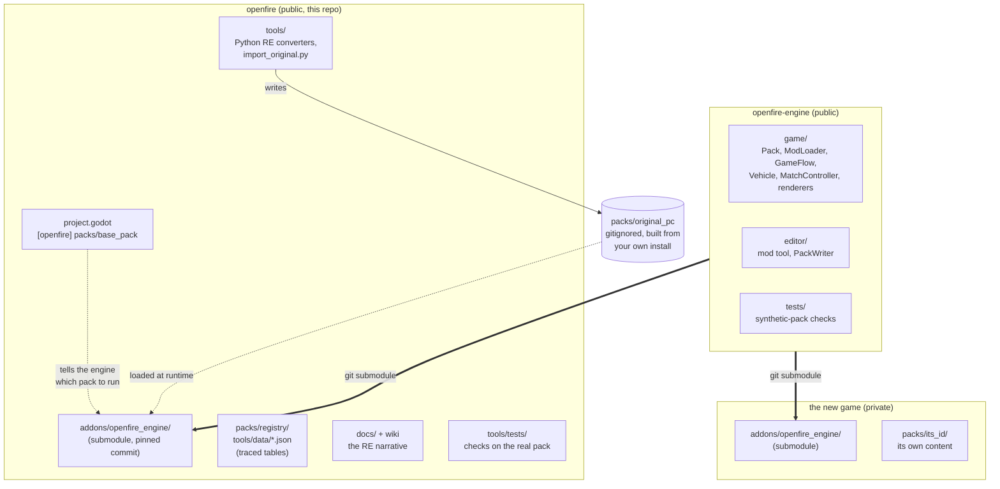
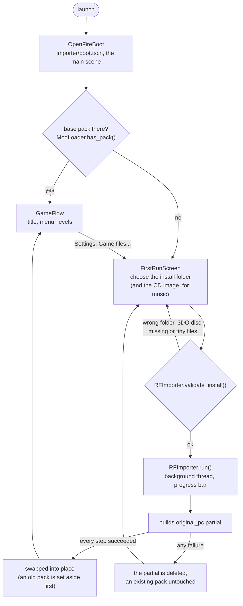
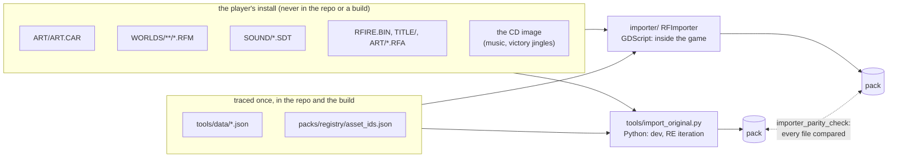

# Architecture

The offline pipeline that turns the original game into a Godot pack, and the shape of the
runtime code that pack loads into — the latter as a few diagrams that go from a glance to the
actual call sites, each one level deeper than the last, rather than one diagram trying to
show everything at once. For the detailed ground truth behind either half, see
[`PORTING_PLAN.md`](PORTING_PLAN.md); for how each piece was found, see
[the wiki](https://github.com/alexdia25/openfire/wiki/) (the worked examples) and [the issues](https://github.com/alexdia25/openfire/issues) (open work).

## The pipeline

```mermaid
flowchart LR
    A["Original game<br/>not shipped"]
    B["Toolchain<br/>Ghidra + Python"]
    C["Data packs<br/>not committed"]
    D["Godot runtime<br/>ships in repo"]
    A --> B --> C --> D
    Docs["Documentation and tracing<br/>every finding traced and paired"]
    A -.-> Docs
    B -.-> Docs
    C -.-> Docs
    D -.-> Docs
```

The original 1996 executable and its data files (`C:\Users\Alex\Documents\returnfire`) are
never touched by the shipped code — Ghidra and a set of Python extractors
(`tools/extract_*.py`, `tools/convert_*.py`) read them offline and produce a **data pack**
(`packs/original_pc/`: sprites, terrain, levels, vehicles, HUD, audio). Packs embed real
extracted pixel and audio data, so — like the Ghidra project and every raw `.RFA`/`.RFM`/
`.SDT`/`.CAR`/`.BIN` file — they're gitignored; only the hand-authored ID registry under
`packs/registry/` is tracked. The Godot runtime (the engine, `addons/openfire_engine/`) is the only stage that ships:
it loads a pack at runtime (never through `res://` import, since the pack doesn't exist at
edit time) and contains no decompiled code or original assets, just GDScript. Underneath all
four stages, the [wiki's worked examples](https://github.com/alexdia25/openfire/wiki/) pair each decompiled/disassembled finding with the port
code it became, and `PORTING_PLAN.md` is the standing summary of all of it.

A pack need not stand alone: `Pack` loads a **stack** of them (`PORTING_PLAN.md` section 2.7.4) — a
mod's `pack.json` names its `base_pack`, which loads underneath it, and the mod overrides the base per
id (one sprite, one vehicle type, one sound cue, one level) rather than replacing it wholesale. The
`Pack` node in the diagrams below stands for that whole resolved stack.

The mod tool (the engine's `editor/`, run `godot --path . res://addons/openfire_engine/editor/editor_main.tscn`;
[`EDITOR_PLAN.md`](EDITOR_PLAN.md)) is a second, separate scene over the same `Pack`: it opens one mod layer as a
`ModWorkspace`, edits it live and writes only that layer back.

## Two repositories

Since issue #62 the runtime lives in its own repository,
[openfire-engine](https://github.com/alexdia25/openfire-engine), and this repo consumes it as a git
submodule at `addons/openfire_engine/`, exactly as any other game built on it does. The split follows one
rule: **the engine names no game.** Anything that only makes sense for Return Fire stays here.

```mermaid
flowchart TB
    subgraph engine["openfire-engine (public)"]
        direction LR
        EG["game/<br/>Pack, ModLoader, GameFlow,<br/>Vehicle, MatchController, renderers"]
        EE["editor/<br/>mod tool, PackWriter"]
        ET["tests/<br/>synthetic-pack checks"]
    end
    subgraph openfire["openfire (public, this repo)"]
        direction LR
        SUB["addons/openfire_engine/<br/>(submodule, pinned commit)"]
        TOOLS["tools/<br/>Python RE converters,<br/>import_original.py"]
        REG["packs/registry/<br/>tools/data/*.json<br/>(traced tables)"]
        DOCS["docs/ + wiki<br/>the RE narrative"]
        TESTS["tools/tests/<br/>checks on the real pack"]
        CFG["project.godot<br/>[openfire] packs/base_pack"]
    end
    subgraph newgame["the new game (private)"]
        direction LR
        NSUB["addons/openfire_engine/<br/>(submodule)"]
        NP["packs/its_id/<br/>its own content"]
    end
    engine == "git submodule" ==> SUB
    engine == "git submodule" ==> NSUB
    CFG -. "tells the engine<br/>which pack to run" .-> SUB
    TOOLS -- "writes" --> PACK[("packs/original_pc<br/>gitignored, built from<br/>your own install")]
    PACK -. "loaded at runtime" .-> SUB
```

| Lives in | What | Why there |
|---|---|---|
| openfire-engine | `game/` (runtime), `editor/` (mod tool), engine tests | reusable by any game; never names one |
| openfire | `tools/` (converters, `import_original.py`), `tools/data/`, `packs/registry/` | Return Fire's file formats and traced tables |
| openfire | `tools/tests/` | checks that need the real traced pack: authenticity (movement, sounds, the level 1 playthrough) and engine behaviour exercised on real content |
| openfire | `docs/`, the wiki | the reverse-engineering record |

A change the engine needs is a normal PR to openfire-engine, then a submodule bump here (`git submodule update
--remote addons/openfire_engine`, then commit the new pointer). Never edit files inside the submodule checkout as
part of an openfire change. The engine's own docs cover its internals: the runtime's composition, signal
flow and how packs/mods resolve are in
[openfire-engine's ARCHITECTURE.md](https://github.com/alexdia25/openfire-engine/blob/main/docs/ARCHITECTURE.md).

## "Open Fire" mode: importing on the player's machine

A released "Open Fire" build contains the engine and this repo's `importer/`, and no Return Fire content
at all. The game's base pack is built on the player's machine, from their own install, the first time it
runs (issue #61).

```mermaid
flowchart TD
    START(["launch"]) --> BOOT["OpenFireBoot<br/>importer/boot.tscn, the main scene"]
    BOOT --> HAS{"base pack there?<br/>ModLoader.has_pack()"}
    HAS -- yes --> FLOW["GameFlow<br/>title, menu, levels"]
    HAS -- no --> SCREEN["FirstRunScreen<br/>choose the install folder<br/>(and the CD image, for music)"]
    SCREEN --> VAL{"RFImporter.validate_install()"}
    VAL -- "wrong folder, 3DO disc,<br/>missing or tiny files" --> SCREEN
    VAL -- ok --> RUN["RFImporter.run()<br/>background thread, progress bar"]
    RUN --> PARTIAL["builds original_pc.partial"]
    PARTIAL -- "every step succeeded" --> SWAP["swapped into place<br/>(an old pack is set aside first)"]
    PARTIAL -- "any failure" --> CLEAN["the partial is deleted,<br/>an existing pack untouched"]
    CLEAN --> SCREEN
    SWAP --> FLOW
    FLOW -- "Settings, Game files..." --> SCREEN
```

Where the pack goes is not decided in the importer. It imports into whatever the project names as its base
pack, `openfire/packs/base_pack`. That setting is `res://packs/original_pc` in a dev checkout, so running the
project with no pack yet imports straight into the repo's gitignored `packs/`. The "Open Fire" export presets
(`export_presets.cfg`) add the `openfire_import` feature, and `project.godot` overrides the setting for that
feature to `user://packs/original_pc`, the one place an exported game can write. The same presets also pick
which files ship:

| In the "Open Fire" build | Left out |
|---|---|
| the engine (`addons/openfire_engine/game`, `editor`) | the engine's own `tests/` and `tools/` |
| `importer/` (boot scene, first-run screen, the importer) | `tools/tests/`, every `.py` file |
| `tools/data/*.json`, `packs/registry/asset_ids.json`: the traced tables the importer applies | any local `packs/original_pc`, `build/` |

`tools/data/` reaches the build through the presets' include filter. The registry needs
`addons/open_fire_export/`, a small export plugin: `packs/` has a `.gdignore` so the editor never imports a pack's
PNGs, and export filters never look inside an ignored folder. The plugin adds the registry to any build with the
`openfire_import` feature. The engine reads its settings with `get_setting_with_override()`, so the feature's
`packs/base_pack.openfire_import` override takes effect in the exported game.

### Two pipelines, one pack

```mermaid
flowchart LR
    subgraph install["the player's install (never in the repo or a build)"]
        direction TB
        CAR["ART/ART.CAR"]
        RFM["WORLDS/**/*.RFM"]
        SDT["SOUND/*.SDT"]
        BIN["RFIRE.BIN, TITLE/, ART/*.RFA"]
        ISO["the CD image<br/>(music, victory jingles)"]
    end
    subgraph traced["traced once, in the repo and the build"]
        direction TB
        DATA["tools/data/*.json"]
        REG["packs/registry/asset_ids.json"]
    end
    PY["tools/import_original.py<br/>Python: dev, RE iteration"]
    GD["importer/ RFImporter<br/>GDScript: inside the game"]
    install --> PY
    install --> GD
    traced --> PY
    traced --> GD
    PY --> P1[("pack")]
    GD --> P2[("pack")]
    P1 <-. "importer_parity_check:<br/>every file compared" .-> P2
```

`importer/` is a GDScript port of the subset of `tools/` that a player's import needs. Nothing about the
original game is re-traced at import time: the tables the RE work produced (`tools/data`, the registry) ship
with the build, and the importer applies them to the player's files.

| Python (`tools/`) | GDScript (`importer/`) |
|---|---|
| `import_original.py` (orchestration, `validate_install`) | `rf_importer.gd` (`RFImporter`) |
| `convert_car.py`, `rf_effect_cel.py` | `car_decoder.gd` |
| `convert_rfm.py`, `rf_tile_art.py` | `rfm_decoder.gd` |
| `convert_sdt.py` | `RFImporter.sdt_problem()` (the files are copied as they are) |
| `build_pack.py` | `pack_builder.gd`, writing through the engine's `PackWriter` |
| `extract_hud_strip.py`, `extract_win_banners.py`, `extract_compass_lamps.py`, `extract_music.py`, `extract_win_jingles.py`, `rfexe.py` | `extras.gd`, `rf_exe.gd`, `iso9660.gd` |
| `validate_pack.py` | `RFImporter.validate_pack()` |

`tools/tests/importer_parity_check.gd` runs both pipelines on the same install
(`RF_GAME_DIR=<install>`, `RF_PARITY_REFERENCE=<Python-built pack>`) and compares every file the Python pack
has: JSON by value, images by pixel, everything else byte for byte. It first passed on 2026-10-01 (2,672
files, no differences). Under issue #61's decision 3 as corrected, **the GDScript importer is canonical from
then on**: if the two ever disagree, Python is what gets fixed, and a new traced mechanic or asset type lands
in `importer/` first. Python stays the fast tool for cracking a new format without a Godot round-trip.

One recorded difference, a port choice: Godot has no Ogg Vorbis encoder, so the importer stores the music
and the victory jingles' audio as QOA-compressed `AudioStreamWAV` resources (`.res`). The engine's
`AudioFiles` loads either format, and the parity check compares those files by duration.
