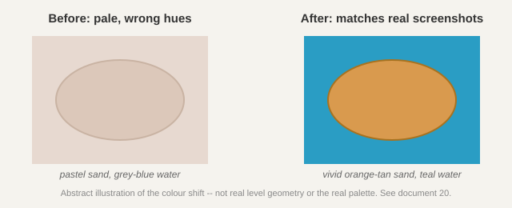
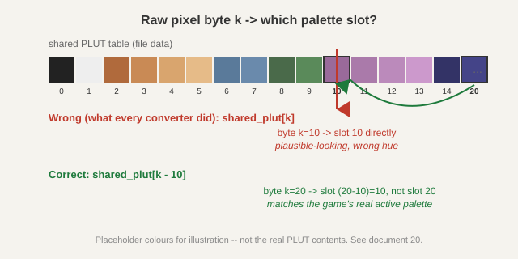

# 20. Worked example: a wrong palette that never looked wrong enough to notice

Every earlier worked example either landed a clean answer or hit an honest dead end. This
one is different: it's a bug that had been shipping silently since section 1.6 first decoded
`ART.CAR`'s palette, survived the entire asset-registry classification effort (documents 19,
~2165 cels looked at by eye), and was only caught because the user compared a Godot
screenshot against real screenshots of the actual game and said "our palette must be wrong."

## The symptom

[Document 19](19-worked-example-asset-registry.md) and Phase 4 step 1 (PORTING_PLAN.md)
had already gotten a real level rendering in Godot, pack and all. It looked *plausible* --
recognisable coastlines, a structure placed correctly, markers in the right spots -- plausible
enough that nothing about it screamed "wrong." The user pulled up real screenshots from
[myabandonware.com](https://www.myabandonware.com/game/return-fire-bau) and the difference was
immediate: real sand is a rich orange-tan, real water is a vivid teal. Our render showed pale
pastel sand and grey-blue water. Same shapes, wrong hues -- exactly the kind of bug that a
purely-visual QA pass (which is most of what document 19 was) will never catch, because
nothing about a wrong-but-plausible palette *looks* broken in isolation.



## Ruling out the easy explanations first

Before touching any code, two cheap checks:

1. **Is the palette table itself being read correctly?** Section 1.6 had already verified
   entry 2 of the shared PLUT decodes to `RGB(0xB5, 0x85, 0x57)` = `(181, 133, 87)`. Sampling
   the real screenshot's actual sand pixels gave `(181, 133, 87)` almost exactly. So the
   **table** was right; entry 2 really is that rich tan. The bug had to be in *which entry* a
   given raw pixel byte resolves to, not in how any individual entry gets decoded.
2. **Is this install's `ART.CAR` corrupted or altered?** This project had already found this
   install's `Score.WAV` and `.avi` cutscenes were stripped (section 1.2/1.8), so a modified
   file wasn't a crazy guess. Mounting the reference retail ISO (section 1.11) and comparing
   `Art/Art.car`'s MD5 against the install's copy: **identical.** Ruled out in one command --
   cheaper than any code trace, so worth doing first (document 6's "cheapest check first"
   habit, informally).

## Finding where pixels actually meet colour

With the table confirmed correct and the file confirmed genuine, the bug had to be in *how*
a raw pixel byte gets turned into a colour at runtime -- somewhere between "index into the
file's PLUT" (what every converter so far assumed) and "colour on screen." That meant finding
where `RFIRE.BIN` actually installs its real, active 8-bit palette, not just where it builds
scratch tables for other purposes.

`FUN_00424420` (already decompiled for section 1.6's tint-table work) builds *two* palette
objects, both `CreatePalette` calls:

- `DAT_0046a8f4`, from a block `cel0_plut + 0x400` -- already known: this is the
  "master palette" used only for `GetNearestPaletteIndex` when building the shadow/tint/glow
  translation tables (section 1.6). Rendering a test atlas through *this* table actually
  looked closer to real sand for some cels -- an early, tempting, and ultimately wrong lead;
  it broke down completely on water (rendered solid white). A reminder that "looks a bit
  better" isn't the same as "is the actual mechanism" -- exactly document 6's standing
  warning against trusting a plausible-looking result without tracing it.
- `DAT_00448ccc`, from `local_498`, filled by walking the **shared PLUT directly** --
  mathematically identical content to what every converter already decodes. A dead end by
  itself, since it doesn't change anything -- until following where it's actually *consumed*.

`FindDataXrefs.java` on `DAT_00448ccc` turned up `FUN_0041e960`, a short, decisive function:

```c
void FUN_0041e960(void) {
  GetPaletteEntries(DAT_00448ccc, 0, 0x100, local_404);
  // zero all 256 entries of DAT_0045bb94, then:
  for (i = 0; i < 246; i++) {
    DAT_0045bb94[10 + i].peRed   = local_404[i].peRed;
    DAT_0045bb94[10 + i].peGreen = local_404[i].peGreen;
    DAT_0045bb94[10 + i].peBlue  = local_404[i].peBlue;
  }
}
```

`DAT_0045bb94` slot `10 + i` gets the shared PLUT's entry `i`. Slots 0-9 stay black --
the standard Win95 static-system-palette reservation. `FindVtableCall.java` on offset `0x7c`
(`IDirectDrawSurface::SetPalette`'s vtable slot) found exactly one caller, `FUN_0042feb0` --
a palette **fade routine** (dims `DAT_0045bb94` toward black over time using `timeGetTime()`,
then calls `SetEntries` with the result). `DAT_0045bb94` -- not either of the two tables built
in `FUN_00424420` -- is the one real, active DirectDraw palette every pixel on screen is
actually shown through.

## The fix, and why it was easy to miss

A raw pixel byte `k` is used directly as a framebuffer index (confirmed separately: the
regular-sprite blit path, `PRE0 == 0`'s `case 0` in the per-cel dispatcher `FUN_00418ef0`,
does a plain index copy with no palette math at blit time at all -- the colour only gets
decided at *presentation*, through whatever palette is currently active). Since the active
palette shifts the shared PLUT's entries up by 10 slots, the colour actually shown for byte
`k` is `shared_plut[k - 10]` (black if `k < 10`) -- not `shared_plut[k]`, which is what every
converter had been computing since section 1.6.



Checked against real numbers before touching any code: cel 2's dominant raw byte, 193, gives
`shared_plut[183]` = a plausible sand-adjacent tone; more decisively, a value that had been
decoding to a muddy blue-purple under the old (unshifted) read landed on `shared_plut[2]` =
`(181, 133, 87)` under the new one -- the *exact* tan sampled from the real screenshot.
Rendering the entire terrain block both ways settled it beyond doubt (see the plan doc's
section 1.6 update for the side-by-side).

**Why 10?** Not fully chased -- most likely the low end of the 256-colour space reserved for
Windows' static system palette entries (a standard `PC_RESERVED`/system-colour convention for
apps that install a custom 8-bit palette), with `RFIRE.BIN` choosing to reserve 10 slots
rather than the more common 20 (10 at each end). Good enough to fix the bug; the exact
reservation-size rationale is a low-priority loose end, not blocking anything.

**Why this survived a 2165-cel-by-eye classification pass:** a uniform colour-space shift
doesn't produce garbage -- every colour still comes from the *same real palette*, just the
wrong entry. Sand under the bug wasn't static or noise, it was a genuinely different but
still-plausible pale tone that happened to sit at the un-shifted index. Nothing about looking
at one cel at a time, even carefully, would reveal that the *whole picture* was hued wrong,
because there was no un-shifted reference to compare against inside this project -- only an
external screenshot comparison could catch it. Worth remembering: internal consistency (does
this cel look like a coherent shape) is not the same check as external correctness (does this
match the real thing), and this project's whole art pipeline had only ever exercised the
first one until now.

## What changed, and what didn't

- `tools/convert_car.py`: the shared-PLUT lookup now subtracts 10 from the raw index (cels
  using the two rare own-PLUTs, the 4 `PRE0==17` reticle cels, are untouched -- confirmed via
  `FUN_00419ea0`, a structurally different direct-fetch code path with no evidence of the
  same shift). `build/car/art_atlas.png`/`art_effects.png` regenerated; `packs/original_pc/`
  rebuilt; Phase 4 step 1's screenshot redone -- what had been a lake in a desert is now,
  correctly, a sandy island in the ocean.
- **The asset registry's shapes and structure survive untouched** -- autotile families,
  cel groupings, animation-frame counts are all about geometry, not colour, so document 19's
  classification work didn't need to be redone. A handful of colour-*dependent* labels did
  turn out wrong under the old palette and got relabeled after visual re-inspection: cels
  0/1/3/52 (labeled sand/forest, actually open water) and 84-86 (labeled green furrows,
  actually brown wood planks) -- see `tools/registry/classify_bulk.py`'s correction section.
  **The confirmed tan/green team-colour finding (section 4 item 5) was re-verified against
  the corrected palette and holds exactly as before** -- if anything, more clearly.
- Other colour-word IDs elsewhere in the registry (a "cyan" or "teal" prop, say) have not
  been individually re-audited against the corrected palette. Given the coarse-pass policy
  document 19 already established, that's a deliberate, bounded gap, not an oversight --
  flagged as a followup, not chased down cel-by-cel right now.

## The lesson

This project's verification habits (render and look, check against every real file, never
trust a plausible byte count) are all about catching a *specific* wrong hypothesis against
*this project's own data*. None of them catch a bug that produces internally-consistent,
plausible-looking, wrong output -- that needs an outside reference. The user comparing a
screenshot to the real game is exactly that outside reference, and it's worth treating "does
this match a real screenshot" as a standing check going forward, not a one-time fix -- the
same blind spot could exist anywhere else this project has only ever checked its own output
against itself.

**Next:** back to [the next-steps doc](NEXT_STEPS.md) for the current backlog -- Phase 4
step 2 (a player-controlled vehicle) is next, now against correctly-coloured art.
